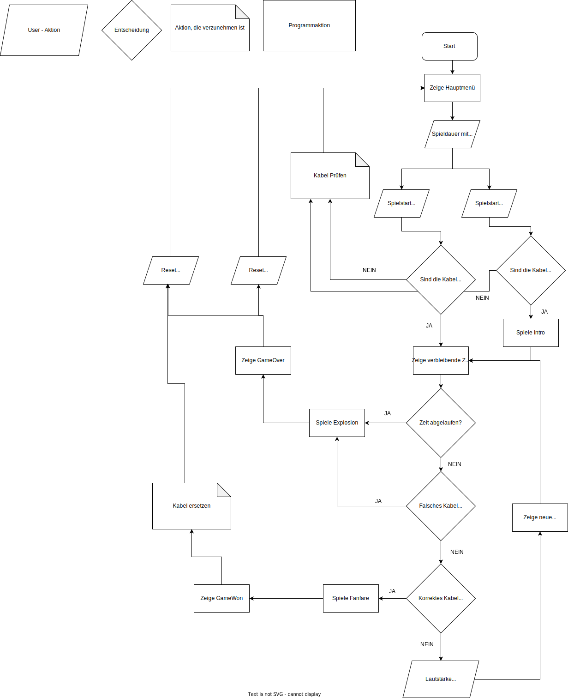
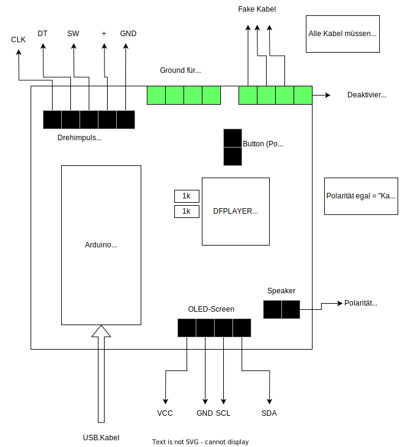

# B-Attrappe
## Brief
Software for a combined timing- and media playback device used in an Escape Room. All following documentation is written in German. 

## Funktionsübersicht

Die Spielleitung kann mit einem Drehimpulsgeber zwischen 3 Spielzeiten wählen. 

Hierfür wird ein Menü auf dem OLED angezeigt. 

Das Symbol ">" zeigt an, welche Zeit ausgewählt ist. 

Mit dem Knopf des Drehimpulsgebers wird das Spiel gestartet. 

Alternativ kann das Spiel mit dem Intro-Knopf gestartet werden. 

Dieser erlaubt den Teilnehmenden weiterhin, jederzeit eine Intro-Nachricht mit dem DFplayer abzuspielen. 

Wird das Spiel gestartet, zeigt der OLED die verbleibende Spielzeit an. 

Während des Spiels kann mit dem Drehimpulsgeber die Lautstärke des DFplayer manipuliert werden.

Die Teilnehmenden müssen herausfinden, welches der vier Kabel zertrennt werden muss, um das Gerät zu entschärfen. 

Wird das korrekte Kabel gekappt, wird eine Gratulationsnachricht abgespielt. 

Läuft die Zeit ab, oder wird das falsche Kabel gekappt, wird ein Explosionsgeräusch abgespielt.

Wenn das Spiel gewonnen oder verloren wird, kann das Gerät mit den Knöpfen (Intro oder Encoder) resettet werden. 

Das Gerät prüft vor Spielstart, ob alle Kabel korrekt verbunden sind - ansonsten wird das Spiel nicht gestartet, um Fehlern vorzubeugen. 

## Vorbereitung 
Alle Kabel vom rechten grünen Schraubterminal müssen mit dem linken grünen Schraubterminal verbunden werden. 

Andernfalls wird der Start des Timers verhindert. 

Die Reihenfolge der Verbindungen links ist hierbei unerheblich. 

Das äußere rechte Schraubterminal (Siehe Platinenübersicht in diesem Dokument) ist für das Deaktivierungskabel vorgesehen. 

An dieser Stelle sollte ein zum Spielfluss passendes Kabel (BLAU) verwendet werden. 

Die Farbgebung der anderen Kabel kann nach Gutdünken erfolgen.

Die Mikro-SD Karte muss präpariert werden, indem drei Ordner mit den Namen "01", "02", "03" erstellt werden. 

In diesen Ordnern ist jeweils eine Datei im mp3-Format abzuspeichern. 

Diese muss den Dateinamen "0001.mp3" erhalten. 

#### Achtung: Wird zur Vorbereitung der SD-Karte ein MAC oder Linux Computer benutzt, sind eventuell zusätzliche Schritte zu befolgen. Diese sind der DFPlayer-Dokumentation zu enehmen. Wir empfehlen die Verwendung eines Windows-Systems!

Der Abspielzeitpunkt der MP3-Dateien ist der folgenden Tabelle zu entnehmen. 

| Ordner | Abspielzeitpunkt |
|--------|------------------|
| 01     | Intro            |
| 02     | Game Over        |
| 03     | Game Won         |

## Verwendete Komponenten

| Komponente                         | Anzahl | Funktion                                                                        | Optional? |
|------------------------------------|--------|---------------------------------------------------------------------------------|-----------|
| Arduino Nano                       | 1      | Microcontroller (es können andere Microcontroller verwendet werden)                                                                |           |
| DFPlayer Mini                      | 1      | Spielt MP3 von SD-Karte                                                         |           |
| Drehimpulsgeber mit Button         | 1      | User Input (versch. Funktionen)                                                 |           |
| OLED-Screen 128x64                 | 1      | User Output                                                                     |           |
| Knopf (Vandalismustaster)          | 1      | Intro abspielen                                                            |           |
| 1k Resistor                        | 2      | Noise reduzieren                                                                |           |
| Dupont Pinheader 1x5 - male        | 1      | Verbinden des Drehimpulsgebers                                                  | x         |
| Dupont Pinheader 1x4 - male        | 1      | Verbinden des OLED-Screens                                                      | x         |
| Dupont Pinheader 1x2 - male        | 2      | Verbinden des Introbuttons, Verbinden des Lautsprechers                         | x         |
| Dupont Pinheader 1x8 - female      | 2      | Verbinden des DFPlayer                                                          | x         |
| Lochrasterplatine                  | 1      | Hält andere Komponenten                                                         | x         |
| Schraubterminals 5.08mm Grün 1x2er | 4      | Verbinden der zerschneidbaren Kabel - zu 2x4er zusammenstecken                  | x         |
| Micro SD-Karte                     | 1      | Enthält Dateien zum Abspielen mit DFPlayer - Größe egal, muss nur 3 MP3s halten |           |
| Lautsprecher                       | 1      | Macht Geräusche                                                                 |           |
## Verbindungen Arduino

| Pin Arduino Nano  | Pin andere Komponente                       | Notizen                              |
|-----------------------|-------------------------------------------------|------------------------------------------|
| 5V                    | OLED-Pinheader (OLED-VCC)                       |                                          |
| 5V                    | Drehimpulsgeber Pinheader (Drehimpulsgeber +)   |                                          |
| 5V                    | DFPlayer VCC                                    |                                          |
| GND                   | OLED-Pinheader (OLED-GND)                       |                                          |
| GND                   | Drehimpulsgeber Pinheader (Drehimpulsgeber GND) |                                          |
| GND                   | Introbutton Pinheader                           | (Polarität egal)                                              |
| GND                   | Kabel Schraubterminal Links                     |                                          |
| GND                   | DFPlayer GND                                    |                                          |
| A4                    | OLED-Pinheader (SDA)                            | Hardware i2c - nicht änderbar            |
| A5                    | OLED-Pinheader (SCL)                            | Hardware i2c - nicht änderbar            |
| D11                   | DFPlayer RX (via 1k Resistor)                   | 1k Resistor unterdrückt Noise            |
| D12                   | DFPlayer TX (via 1k Resistor)                   | 1k Resistor unterdrückt Noise            |
| D10                   | Drehimpulsgeber Pinheader (Drehimpulsgeber SW)  | Button des Impulsgebers                  |
| D2                    | Drehimpulsgeber Pinheader (Drehimpulsgeber CLK) | D2 unterstützt Interrupts - nicht ändern |
| D3                    | Drehimpulsgeber Pinheader (Drehimpulsgeber DT)  | D3 unterstützt Interrupts - nicht ändern |
| D5                    | Introbutton Pinheader                           | Eingang des Introbuttons    (Polarität egal)                  |
| D9, D8, D7            | Kabel Schraubterminal Rechts                    | Eingänge für falsche Kabel               |
| D6                    | Kabel Schraubterminal Rechts                    | Eingang Deaktivierungskabel              |

## Andere Verbindungen

| Verbindung A   | Verbindung B           | Notiz                               |
|----------------|------------------------|-------------------------------------|
| DFPlayer SPK_1 | Pinheader Lautsprecher | Bei Lautsprecher ist Polarität egal |
| DFPlayer SPK_2 | Pinheader Lautsprecher | Bei Lautsprecher ist Polarität egal |

## Ablaufplan

## Platinenübersicht

## Platinenübersicht Alternativ

Die 2 gebauten Platinen weichen leicht voneinander ab. 
Dies ist die Übersicht der kleineren Platine
Durch einen Lötfehler sind hier Pin 11 und 12 vertauscht. 

